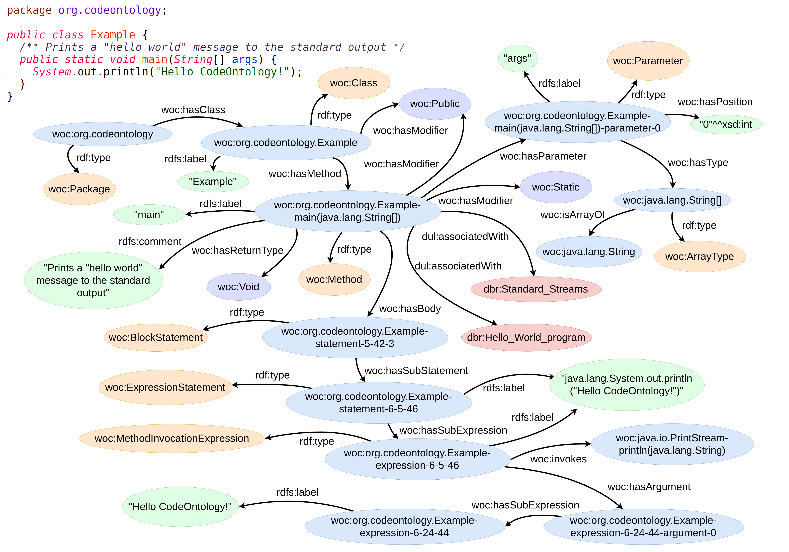

The parser provided by CodeOntology allows to analyze Java source code and generate RDF triples.
It is available on <a class="relevant" href="https://github.com/codeontology/parser">GitHub</a>, along with a tutorial on how to use it to analyze different kinds of Java projects.

The following image shows an excerpt of the output of the parser, when it is applied to a simple Hello World program.
For more details, see the <a class="relevant" href="{{ site.baseurl }}/doc">documentation</a> and the <a class="relevant" href="{{ site.baseurl }}/examples">query examples</a>.

The parser has been applied to extract a knowledge base from the OpenJDK 8 source code.
Here are some details about the extracted RDF triples. As we can see, most of the triples generated by the parser are about structural  information common to all object-oriented programming languages, like class hierarchy, methods and constructors.

<ul>
<li>Structural information on source code: 1981108 triples</li>
<li>DBpedia links: 309688 triples</li>
<li>Actual source code as literals: 134757 triples</li>
<li>Literal Comments: 105881 triples</li>
</ul>

This breakdown of the dataset extracted from OpenJDK is available for download on <a class="relevant" href="https://doi.org/10.5281/zenodo.818116">Zenodo</a>. Furthermore, it can be queried directly through our remote <a class="relevant" href="{{ site.baseurl }}/sparql">SPARQL endpoint</a>.

